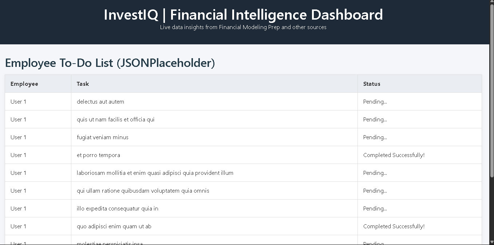

Here’s a **cleaned-up and improved version** of your `README.md`, fully aligned with what we did for the `webapps` application, Dockerized with HAProxy load balancing:

---

# WebApps – Playing Around with APIs

## Overview

This project demonstrates how to build, containerize, and deploy a web application that consumes external APIs. The app allows users to interact with real-time financial bond data, including features such as **sorting**, **filtering**, and **searching**.

The deployment is containerized using **Docker**, scaled across two app instances (`web01` and `web02`), and **load-balanced with HAProxy**.

---

## Table of Contents

* [Features](#features)
* [APIs Used](#apis-used)
* [Local Setup](#local-setup)
* [Docker Image Details](#docker-image-details)
* [Building Docker Images](#building-docker-images)
* [Running with Docker Compose](#running-with-docker-compose)
* [Deployment Instructions](#deployment-instructions)
* [Load Balancer Setup](#load-balancer-setup)
* [Testing Load Balancing](#testing-load-balancing)
* [Security & Hardening](#security--hardening)
* [Credits](#credits)
* [Challenges](#challenges)
* [License](#license)

---

## Features

* Fetches and displays real-time bond data via external API.
* Sort, filter, and search functionality for enhanced usability.
* Load-balanced across multiple app instances.
* Redis caching for performance (optional).
* Dockerized with support for scaling and automated build/deploy.

---

## APIs Used

* **Financial Modeling Prep API**

  * **Docs**: [https://site.financialmodelingprep.com/developer/docs/](https://site.financialmodelingprep.com/developer/docs/)
  * **Purpose**: Fetch bond yield data used in the application.

---

## Local Setup

1. Clone the repository:

```bash
git clone https://github.com/<your-username>/try_sum.git
cd try_sum
```

2. Create an `.env` file for your API key:

```env
FMI_API_KEY=your_api_key_here
```

3. Run locally (for development):

```bash
python3 -m venv venv
source venv/bin/activate
pip install -r requirements.txt
python app.py
```

Visit: [http://localhost:8080](http://localhost:8080)

---

## Docker Image Details

* **Image Name**: `<dockerhub-username>/webapps`
* **Tags**: `v1`, `latest`
* **Published At**: \[Docker Hub Link]

---

## Building Docker Images

From project root:

```bash
docker build -t <dockerhub-username>/webapps:v1 .
```

Push to Docker Hub:

```bash
docker push <dockerhub-username>/webapps:v1
```

---

## Running with Docker Compose

Use the provided `run.sh`:

```bash
./run.sh
```

This will:

* Stop/remove old containers.
* Build fresh images.
* Start all services (`web01`, `web02`, `redis`, `haproxy`) in the correct network.

---

## Deployment Instructions

On any machine:

1. Pull the image:

```bash
docker pull <dockerhub-username>/webapps:v1
```

2. Run with env file:

```bash
docker run -d --name web01 --restart unless-stopped \
  --env-file FMI_API_KEY.env -p 8080:8080 \
  <dockerhub-username>/webapps:v1
```

Repeat for `web02` (use a different port, e.g., `-p 8081:8080`).

---

## Load Balancer Setup

### `haproxy.cfg`:

```haproxy
frontend http_front
    bind *:80
    mode http
    default_backend webapps

backend webapps
    mode http
    balance roundrobin
    option httpchk GET /
    http-check expect status 200
    cookie SERVERID insert indirect nocache
    server web01 web01:8080 check cookie web01
    server web02 web02:8080 check cookie web02
```

### Reload HAProxy (inside container):

```bash
docker exec -it <haproxy-container-name> sh -c 'haproxy -sf $(pidof haproxy) -f /usr/local/etc/haproxy/haproxy.cfg'
```

---

## Testing Load Balancing

Run this command to hit the load balancer 10 times and observe `SERVERID`:

```bash
for i in {1..10}; do curl -sI http://localhost | grep SERVERID; done
```

You should see responses alternating between `web01` and `web02`.

---

## Security & Hardening

* API keys are injected using `env_file`, not hardcoded.
* `.gitignore` includes `.env` to prevent secrets from leaking.
* Use Docker Secrets or Vault in production for sensitive data.

---

## Credits

* [Financial Modeling Prep API](https://financialmodelingprep.com)
* Flask, HAProxy, Docker

---

## Challenges

* Docker networking: ensuring `redis` and `webapps` containers resolved correctly.
* Load balancing setup: configuring HAProxy for cookie-based sticky sessions.
* Debugging internal server errors related to Redis resolution.

## NB: 
If you see a sample image like the one shown, it simply means someone else is using the API—no error at our end.


---

## Demo

A short demo video is included in the repo showing:

* URL Demo Link: https://youtu.be/iDW215NPcYc
* Local testing
* Docker Compose setup
* Load-balanced responses via HAProxy

---

## License

This project is for educational use only. All rights reserved by the authors.


